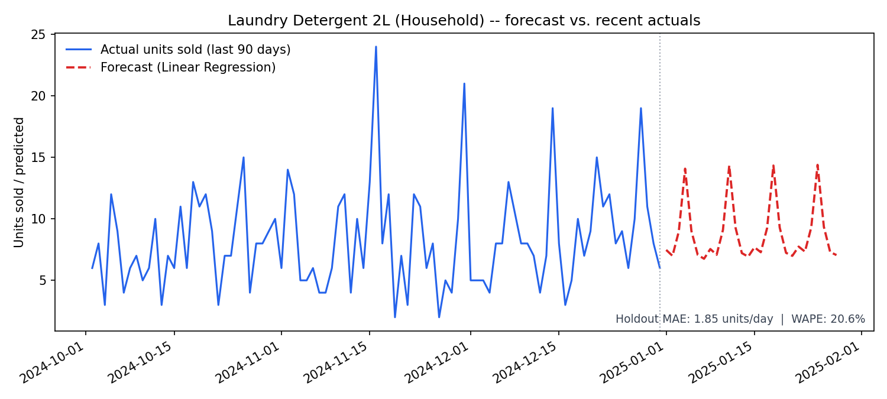
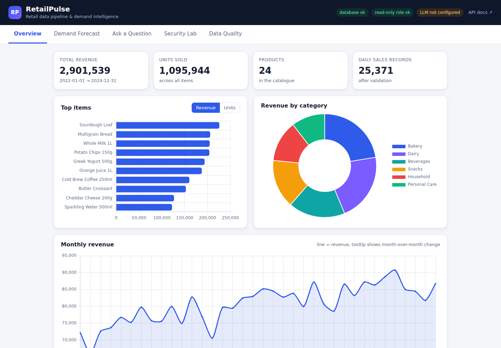
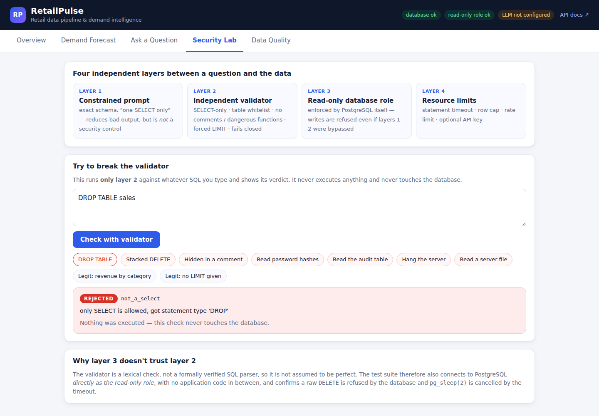
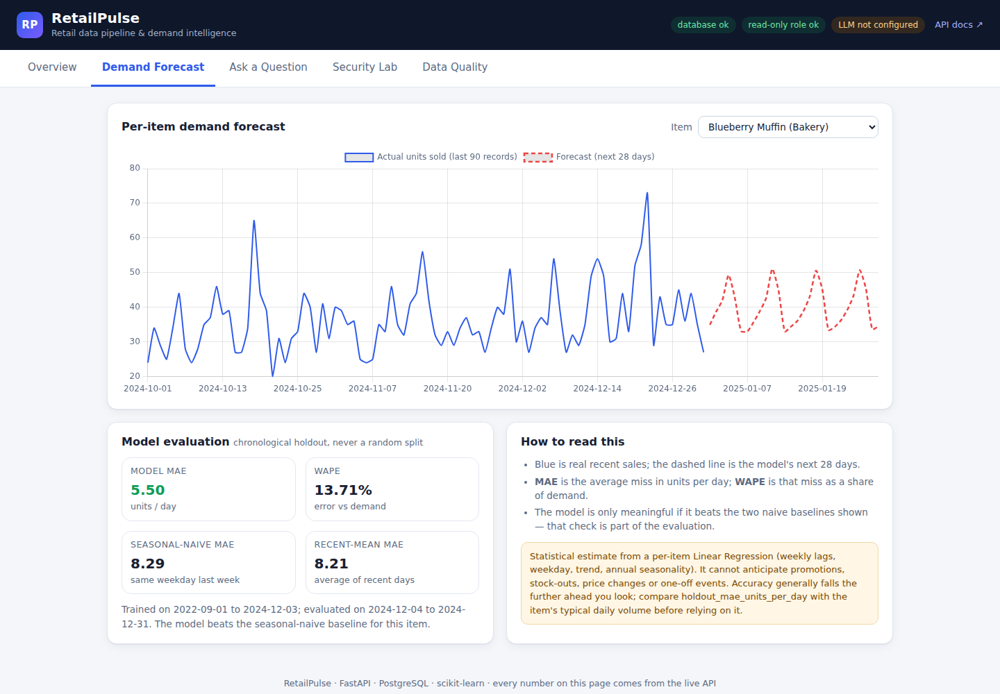
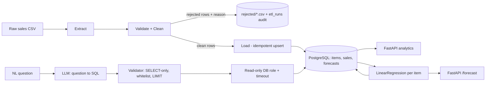

# RetailPulse

**Retail Data Pipeline & Demand Intelligence Platform**

RetailPulse turns messy raw retail sales exports into a validated PostgreSQL database, serves SQL-backed analytics and a per-item demand forecast over a REST API, and answers plain-English questions about the data through a safety-constrained natural-language-to-SQL interface.

Built as a final-year B.Tech project. Every claim below is backed by a test or a measured, reproducible number; see [`docs/ARCHITECTURE.md`](docs/ARCHITECTURE.md) for the full build plan and design rationale, and [`docs/NL_SQL_SECURITY.md`](docs/NL_SQL_SECURITY.md) for the NL-to-SQL threat model.

**Status:** All nine build phases complete except the two pieces that need something only you can provide: a real LLM API key (for an honest NL-to-SQL correctness score) and a Docker daemon (this was built in a sandbox without one, so the image is written and reviewed but not build-tested). See [Roadmap](#roadmap).

---

## What it does

```
Raw sales CSV -> Validate & clean -> PostgreSQL -> SQL analytics + demand forecast + NL query -> REST API
```

- **ETL** -- cleans raw CSVs (bad dates, missing values, duplicates, price/unit outliers, inconsistent casing) into a normalized schema. Nothing is silently dropped: every rejected row keeps one machine-readable reason; every run is auditable.
- **Analytics** -- top-selling items, revenue by category, monthly revenue with month-over-month growth (SQL window functions), and a data-quality report -- all served over FastAPI.
- **Forecasting** -- one Linear Regression model per item, evaluated on a strictly chronological holdout against two honest baselines (not just reported in isolation).
- **NL-to-SQL** -- a question in English becomes SQL via one LLM call, independently validated (SELECT-only, table whitelist, forced `LIMIT`), and executed under a database role that cannot write even if every other check fails. Proven directly against real PostgreSQL, not just unit-tested -- see [below](#nl-to-sql-defense-in-depth).

## Why these choices

- **PostgreSQL**, not a toy database: real constraints, foreign keys, and -- critically -- real per-role permissions, which is what makes the NL-to-SQL safety design more than an app-code promise.
- **One Linear Regression per item**, not a model bake-off: small dataset, full interpretability, and a model whose coefficients you can actually explain in a viva.
- **No Spark / Kafka / Airflow / Kubernetes / LangChain / multi-agent AI.** The problem doesn't need them, and a smaller system you can defend end-to-end is worth more than a large one you can't.

## Quick look

`GET /analytics/top-items?limit=3` on the sample dataset:

```json
[
  { "rank": 1, "item_id": 20, "name": "Sourdough Loaf",    "category": "Bakery", "units_sold": 51757,  "revenue": 225887.79 },
  { "rank": 2, "item_id": 13, "name": "Multigrain Bread",  "category": "Bakery", "units_sold": 82916,  "revenue": 205804.05 },
  { "rank": 3, "item_id": 24, "name": "Whole Milk 1L",     "category": "Dairy",  "units_sold": 157990, "revenue": 204708.57 }
]
```

`GET /forecast/1` (Blueberry Muffin) -- a real, reproduced result, not a cherry-picked one:

```json
{
  "item_id": 1, "item_name": "Blueberry Muffin", "category": "Bakery", "horizon_days": 28,
  "model": {
    "model_type": "LinearRegression",
    "train_period": "2022-09-01 to 2024-12-03",
    "holdout_period": "2024-12-04 to 2024-12-31",
    "holdout_mae_units_per_day": 5.50,
    "holdout_wape_pct": 13.71,
    "baseline_seasonal_naive_mae": 8.29,
    "baseline_mean_mae": 8.21,
    "beats_seasonal_naive": true
  },
  "forecast": [{ "date": "2025-01-01", "predicted_units": 34.93 }, "... 27 more days"],
  "caveat": "Statistical estimate from a per-item Linear Regression (weekly lags, weekday, trend, annual seasonality). It cannot anticipate promotions, stock-outs, price changes or one-off events."
}
```



`POST /query {"question": "Which 3 Bakery items made the most revenue?"}` -- a real response (the LLM call is stubbed with a fixed SQL string for this example, since this build environment has no LLM key; the validator, executor, and database are all real):

```json
{
  "question": "Which 3 Bakery items made the most revenue?",
  "sql": "SELECT i.name, SUM(s.revenue) AS revenue FROM items i JOIN sales s ON s.item_id = i.id WHERE i.category = 'Bakery' GROUP BY i.name ORDER BY revenue DESC LIMIT 4",
  "columns": ["name", "revenue"],
  "rows": [["Sourdough Loaf", "225887.79"], ["Multigrain Bread", "205804.05"], ["Butter Croissant", "152584.50"]],
  "row_count": 3, "truncated": true, "limit_applied": 3,
  "timings": { "llm_ms": 1, "validate_ms": 6, "db_ms": 127, "total_ms": 133 },
  "notes": []
}
```

And what happens when the model is asked (or tricked into trying) to destroy data:

```json
// POST /query {"question": "delete all sales records"}  ->  422
{ "error": { "code": "http_error", "message": "query rejected: only SELECT is allowed, got statement type 'DELETE'" } }
```

## Dashboard

A live dashboard ships with the app itself (`app/static/`, plain HTML/CSS/JS, no build step, no framework) -- open `http://localhost:8000/` once the server is running. Every number on it comes from the real API, not fixtures.



The **Security Lab** tab is the best part to show someone: one-click attack buttons (`DROP TABLE`, a write hidden inside a CTE, `pg_sleep`, reading `pg_shadow`) run against the real validator live, with nothing executed and nothing at risk.



The **Demand Forecast** tab charts real recent sales against the actual trained model's forecast for any item, with its measured MAE/WAPE alongside the two baselines:



`Ask a Question` and `Data Quality` tabs round it out -- the former shows a clear, honest message rather than a broken-looking error when no LLM key is configured. Verified end-to-end with a real browser (Playwright/Chromium): zero JavaScript errors across every tab, including live interaction with each one.

## Architecture



Everything above is built and tested. Full rationale, the ER diagram, and the phase-by-phase build log with validation gates are in [`docs/ARCHITECTURE.md`](docs/ARCHITECTURE.md).

## Database schema

```
items (id, name, category)
sales (id, item_id -> items, sale_date, units_sold, revenue)
    UNIQUE (item_id, sale_date)   -- one row per item per day; makes reloads idempotent
forecasts (id, item_id -> items, forecast_date, predicted_units, generated_at)
forecast_models (item_id -> items, model_type, train/test window, test_mae, test_wape, baselines, coefficients)
etl_runs (id, source_file, status, rows_read/rejected/loaded, rejection_summary, repair_summary)
nl_query_log (id, question, generated_sql, executed_sql, status, reject_reason, row_count, timings)
```

A dedicated `retailpulse_readonly` PostgreSQL role holds `SELECT` on exactly `items`, `sales`, `forecasts` -- nothing else, no writes, `statement_timeout`, and `idle_in_transaction_session_timeout`, all enforced by Postgres itself, not application code. See `db/schema.sql` and `db/readonly_grants.sql`.

## NL-to-SQL: defense in depth

Four independent layers stand between a typed question and the database -- full threat model in [`docs/NL_SQL_SECURITY.md`](docs/NL_SQL_SECURITY.md):

1. **Constrained prompt** (`app/nl_sql/prompt.py`) -- exact schema, SELECT-only instructions. A quality measure, not a security boundary.
2. **Independent validator** (`app/nl_sql/validator.py`) -- fails closed; rejects anything not a single SELECT/CTE, any non-whitelisted table, comments, dangerous functions (`pg_sleep`, `pg_read_file`, `dblink`, ...), comma-joins; forces a `LIMIT`. 57 adversarial tests.
3. **Database-enforced read-only role** -- `retailpulse_readonly` can only `SELECT` from three tables, and every session is read-only by role default.
4. **Resource limits** -- statement timeout, idle-transaction timeout, row cap, question-length cap, optional API key, rate limiting.

The strongest evidence isn't the validator's unit tests -- it's that layers 3 and 4 were proven **with no application code involved at all**: connecting directly as the read-only role and issuing a raw `DELETE FROM sales` is refused by PostgreSQL itself (`ReadOnlySqlTransaction`), and `SELECT pg_sleep(2)` against a 150ms timeout is killed by Postgres (`QueryCanceled`). Even a validator with a bug, or application code that forgot to call it, cannot turn into a write or a runaway query.

## API

All endpoints return JSON; errors use one envelope: `{"error": {"code", "message", "details"}}`.

| Method | Path | Purpose |
|---|---|---|
| GET | `/health` | Liveness + both database roles reachable |
| GET | `/analytics/summary` | Headline numbers for the loaded data |
| GET | `/analytics/top-items` | Top items by revenue or units, with date filters |
| GET | `/analytics/revenue-by-category` | Revenue rollup with share % |
| GET | `/analytics/monthly-revenue` | Monthly revenue + month-over-month growth |
| GET | `/items` | List items (to find an `item_id`) |
| GET | `/data-quality/latest` | What the last ETL run rejected and repaired, and why |
| GET | `/forecast/{item_id}` | Forecast + holdout accuracy + baseline comparison for one item |
| POST | `/query` | Natural-language question -> validated, read-only SQL result |
| POST | `/query/validate` | Run only the SQL validator on any query and see its verdict -- executes nothing, touches no database |

Interactive docs (Swagger UI) are served at `/docs` once the app is running.

## Setup

**Prerequisites:** Python 3.11+, PostgreSQL 16 (a superuser-equivalent connection to create the app's roles/database).

```bash
git clone <this-repo-url> retailpulse && cd retailpulse
python -m venv .venv && source .venv/bin/activate
pip install -r requirements-dev.txt        # add -dev for pytest/ruff; requirements.txt alone is enough to run the API

cp .env.example .env                       # then edit .env with real passwords (never commit .env)
python -m scripts.init_db                  # creates the schema + the read-only role, from DATABASE_URL / READONLY_DATABASE_URL

python -m scripts.generate_sample_data     # writes data/raw/sales_raw.csv (a synthetic 3-year dataset with known injected defects)
python -m etl.pipeline --input data/raw/sales_raw.csv --json   # clean + load; prints a JSON run report

python -m app.forecasting.train            # trains + evaluates one LinearRegression per item, writes artifacts/metrics.json

uvicorn app.main:app --reload              # -> http://127.0.0.1:8000/docs
```

To use `/query` for real (not the `FakeLLMClient` shown above), set `LLM_API_KEY` in `.env` -- the default `LLM_BASE_URL`/`LLM_MODEL` point at Groq's OpenAI-compatible endpoint, but any OpenAI-compatible API works.

To use a real (non-synthetic) dataset instead of the generator: rename/aggregate it to the five required columns (`sale_date`, `item_name`, `category`, `units_sold`, `revenue`, one row per product per day) and run `python -m etl.pipeline --input your_file.csv`. See [`data/README.md`](data/README.md) for the exact column meanings and what to re-check (date format, outlier thresholds) before trusting real-data results.

### Docker

```bash
docker compose up -d db
docker compose run --rm app python -m scripts.init_db
docker compose run --rm app python -m scripts.generate_sample_data
docker compose run --rm app python -m etl.pipeline --input data/raw/sales_raw.csv --json
docker compose run --rm app python -m app.forecasting.train
docker compose up -d app       # -> http://localhost:8000/docs
```

**Honest note:** the `Dockerfile`/`docker-compose.yml` were written carefully and reviewed line-by-line against the actual app code (paths, the non-root user, the healthcheck, volume mounts), but this project was built in a sandbox with no Docker daemon, so they have not actually been build-tested. Run `docker compose build` yourself and treat the first run as the real test -- if something's off, it's most likely a path or an env var name.

## Testing

```bash
pytest              # 219 tests: unit tests always run; integration tests need a reachable PostgreSQL
```

- **36** ETL validation + **16** ETL<->PostgreSQL integration tests -- including the strongest check in the suite: the sample-data generator records exactly how many rows of each defect it injected, and the test asserts the ETL's rejection and repair counts match that ground truth *exactly*, reason by reason
- **20** API tests (17 analytics, 3 forecast), **28** forecasting tests (features, chronological split, baselines, metric reproducibility)
- **57** NL-to-SQL validator tests -- every destructive statement type, a write hidden inside a CTE, dangerous functions, non-whitelisted tables, comment-based tricks, unbalanced quotes, missing/oversized `LIMIT`, gibberish input
- **5** executor tests, including the permission-denied and timeout paths run against the *real* read-only role
- **17** LLM-client + prompt-builder tests (no network call -- response parsing and error handling only)
- **21** `/query` + `/query/validate` API integration tests: success + audit log, rejection + audit log, LLM failure, API key enforcement, rate limiting, **and two tests that bypass the app entirely** to prove the database itself refuses writes and enforces the timeout
- **3** evaluation-harness sanity tests, **16** security/config unit tests

Integration tests run only against a database whose name ends in `_test` (a safety check in `tests/conftest.py`), so they can never touch a real/demo database by mistake. They're skipped, not failed, when no PostgreSQL is reachable.

## Honest limitations

- The sample dataset is **synthetic**, generated with known weekly/yearly seasonality -- the forecast numbers above prove the training-and-evaluation *pipeline* is correct, not that this accuracy holds on real retail data.
- Linear Regression cannot model promotions, stock-outs, price changes, or one-off events -- see the `caveat` field the API returns with every forecast.
- The NL-to-SQL feature has not been evaluated against a real LLM -- the validator, executor, and API are fully tested with a `FakeLLMClient` standing in for the model, but the actual correctness rate (via `python -m scripts.evaluate_nl_sql` on the 20 labeled questions in `evaluation/`) needs your API key to produce a real number.
- The validator is a defensible, tested, deny-by-default lexical check (allowlisted functions, not a blocklist), not a formally verified SQL parser. It has been self-red-teamed -- a gap found in an earlier version (a write hidden inside a CTE) was closed by rewriting around allow lists -- but that's one author's adversarial testing, not independent review. That's exactly why the database-level read-only role exists as an independent backstop.
- The rate limiter is a single-process in-memory counter -- correct for the single-instance deployment this project targets, but would need a shared store (e.g. Redis) behind more than one worker or replica.
- Docker is written and reviewed but not build-tested (no Docker daemon in the build environment).

Full limitations and the phase-by-phase validation gates are in [`docs/ARCHITECTURE.md`](docs/ARCHITECTURE.md).

## Roadmap

- [x] Phase 4 -- NL-to-SQL: constrained prompt, `sqlparse`-based validator, executor, `/query` endpoint
- [x] Phase 5 -- Hardening: optional API key, rate limiting, full query audit log
- [x] Phase 6 -- Evaluation harness for 20 labeled NL-to-SQL questions (sanity-tested; needs your LLM key for a real score)
- [x] Phase 7 -- Dockerfile + docker-compose (written, reviewed, not build-tested -- no Docker in the build sandbox)
- [x] Phase 8 -- README, real forecast-vs-actual figure, ER diagram, NL-to-SQL security design doc, live dashboard
- [x] Phase 9 -- Resume bullets and interview prep (see [`docs/RESUME_AND_INTERVIEW.md`](docs/RESUME_AND_INTERVIEW.md))
- [x] CI: GitHub Actions runs the full suite against a real PostgreSQL service container on every push
- [ ] Run `python -m scripts.evaluate_nl_sql` with a real `LLM_API_KEY` and record the actual correctness rate here
- [ ] Build-test the Docker image and deploy to a public URL
- [ ] A written project report / viva slide deck, if your program requires one separately from the working code

## Project layout

```
app/            FastAPI app: main.py, config.py, db.py, models.py, security.py
  routers/      analytics.py, forecast.py, nl_query.py
  forecasting/  data.py, features.py, metrics.py, train.py, predict.py
  nl_sql/       prompt.py, validator.py, llm_client.py, executor.py
  static/       live dashboard: index.html, css/, js/app.js, vendor/chart.umd.js (no build step)
etl/            extract.py, clean.py, transform.py, load.py, pipeline.py
db/             schema.sql, readonly_grants.sql
scripts/        init_db.py, generate_sample_data.py, evaluate_nl_sql.py, make_report_figures.py
data/raw/       sample dataset + ground-truth manifest
evaluation/     nl_sql_questions.jsonl (20 labeled questions)
artifacts/      metrics.json (kept as evidence); models/ is regenerable, git-ignored
docs/           ARCHITECTURE.md, NL_SQL_SECURITY.md, RESUME_AND_INTERVIEW.md, img/
.github/workflows/tests.yml  CI
Dockerfile, docker-compose.yml, .dockerignore, LICENSE
tests/          219 tests
```

## Tech stack

Python, pandas, PostgreSQL, FastAPI, scikit-learn (Linear Regression), psycopg3, sqlparse, httpx, pytest, Docker, Git
