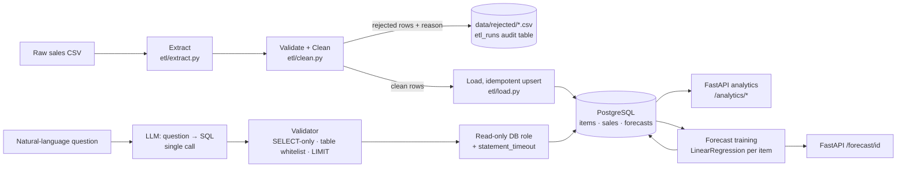
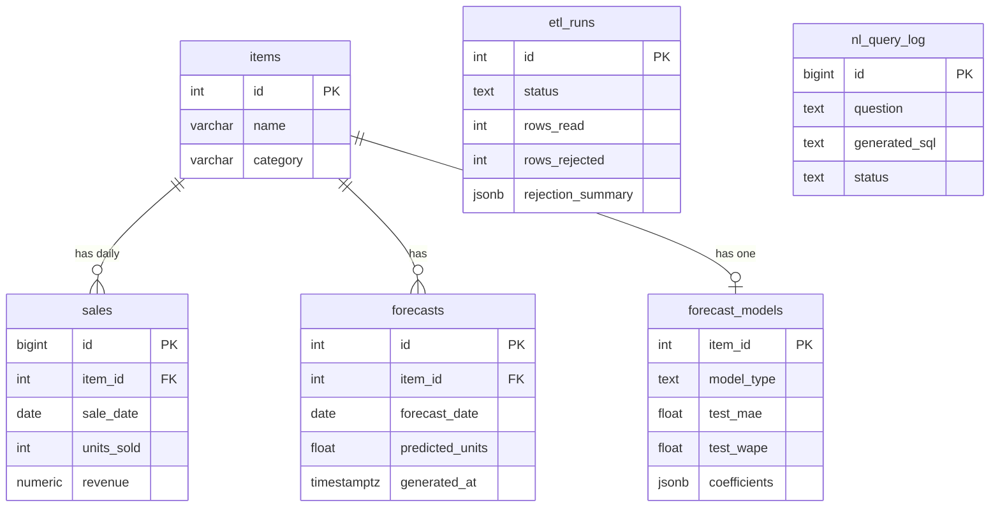

# RetailPulse — Architecture & Implementation Plan

> **Status legend:** ✅ built and verified · 🔜 planned (not built yet). Nothing in this document is marked ✅ unless it has automated tests that pass or a measured result you can re-run.

## 1. What problem this solves

Retail teams get raw sales exports that are messy (missing values, duplicates, bad dates, inconsistent labels). Before anyone can answer "what sells, what will sell, and why did revenue move?", someone has to clean the data, store it reliably, and let non-SQL people ask questions of it.

RetailPulse does four things, in order:

1. **Cleans** raw sales CSVs and loads them into a normalized PostgreSQL schema — and shows exactly what it rejected and why.
2. **Analyzes** the data through SQL-backed REST endpoints.
3. **Forecasts** daily demand per item with one explainable model (Linear Regression).
4. **Answers plain-English questions** by translating them to SQL, then running that SQL under four independent safety layers.

## 2. Architecture



Everything above is built and tested — nothing in this diagram is still a plan.

## 3. Build plan and validation gates

| Phase | Deliverable | Gate to pass before moving on | Status |
|---|---|---|---|
| 0 | Scaffold, schema, read-only role, config | Schema applies cleanly; secrets only via env | ✅ |
| 1 | Synthetic messy dataset + ETL (extract → validate → clean → load) | ETL output matches the generator's ground-truth manifest exactly | ✅ |
| 2 | FastAPI app + SQL analytics endpoints | API tests pass against real PostgreSQL | ✅ |
| 3 | Per-item Linear Regression forecast, chronological evaluation, baselines | Metrics reproduce on re-run; beats naive baselines honestly | ✅ |
| 4 | NL-to-SQL: prompt, validator, executor, `/query` | Adversarial suite: 100% of destructive/invalid inputs rejected | ✅ |
| 5 | Hardening: API key, rate limit, query audit log, safe errors | Tests for each control | ✅ |
| 6 | NL-to-SQL evaluation harness + 20 labeled questions | Harness sanity-tested (scores 100% when fed its own reference SQL) | ✅ harness; 🔜 real LLM score (needs your key) |
| 7 | Deployment (Dockerfile + docker-compose) | Written and reviewed | ✅ written; 🔜 not build-tested (no Docker daemon in the build sandbox) |
| 8 | README, real screenshots/figures, security design doc | Fresh-clone setup works from README alone | ✅ |
| 9 | Resume bullets + interview pack | Every number traceable to a measured result | ✅ |

## 4. ETL design ✅

**Contract:** `Extract → Validate → Clean → Transform → Load`, with the invariant **`rows_read == rows_clean + rows_rejected`** checked on every run — no row can silently vanish.

* **Rejected, never silently dropped.** Each rejected row gets exactly one machine-readable reason (first failing rule wins) and a human-readable detail. Rules run in this order: `missing_item_name`, `missing_date`, `invalid_date`, `date_out_of_range`, `missing_units`, `invalid_units`, `negative_units`, `missing_revenue`, `invalid_revenue`, `negative_revenue`, `zero_units_nonzero_revenue`, `units_outlier`, `price_outlier`, `duplicate_row`, `conflicting_duplicate`.
* **Repaired when the fix is unambiguous:** case/whitespace in names and categories, `$1,234.50` → `1234.50`, `12.0` → `12`, DD/MM/YYYY dates, a missing category is filled from that item's majority category (else `Uncategorized`), and conflicting categories for one item are resolved by majority. Repairs are counted in the run report.
* **Idempotent load:** upserts keyed on `(item_id, sale_date)`, so re-running the same file does not duplicate rows.
* **Audit trail:** every run is recorded in `etl_runs` (rows read/rejected/loaded, per-reason counts, repair counts, path to the rejected-rows file) and exposed at `GET /data-quality/latest`.

**Verified result on the sample data:** the generator writes 26,437 raw rows with a known set of injected defects and records the ground truth in `data/raw/sales_raw.manifest.json`. The ETL loads **25,371 rows and rejects 1,066 — matching the manifest exactly, reason by reason, and repair type by repair type** (asserted in `tests/test_etl_integration.py`).

## 5. Database design ✅



**Grain:** `sales` is one row per item per day. The `UNIQUE (item_id, sale_date)` constraint (`uq_sales_item_date`) enforces that grain, makes reloads idempotent, and — because Postgres backs it with a composite index — serves the dominant query pattern (one item over a date range), which is the index the spec asked for. A second index on `sale_date` serves cross-item date scans.

**Deliberate differences from the approved spec** (all are tightening, none remove anything):

| Spec | Built | Why |
|---|---|---|
| Plain index on `(item_id, sale_date)` | `UNIQUE` constraint on the same columns (still gives the index) | Enforces the daily grain; enables idempotent upsert |
| Nullable/unchecked columns | `NOT NULL` + `CHECK (units_sold >= 0, revenue >= 0)` | Database refuses bad data even if the ETL has a bug |
| 3 tables | + `forecast_models`, `etl_runs`, `nl_query_log` | Store evaluation metrics, ETL audit trail, and NL query audit trail |
| Read-only role with SELECT | + role-level `default_transaction_read_only`, `statement_timeout = 5s`, no `TEMP`/`CREATE` | Extra database-enforced limits that don't depend on app code |
| "Gemini or Groq" SDK | Any OpenAI-compatible endpoint via plain HTTP | One code path, no vendor SDK; still exactly one LLM call per question |

The read-only role can `SELECT` from exactly `items`, `sales`, `forecasts`. The audit tables (`etl_runs`, `nl_query_log`, `forecast_models`) are not granted to it.

## 6. Forecasting ✅

* **Model:** one `LinearRegression` per item (scikit-learn). No other model, by design — one well-understood model beats a bake-off you can't fully explain.
* **Features (12):** `lag_7`, `lag_14`, `roll_mean_7_at_lag_7`, `trend_years`, day-of-week dummies (Tue–Sun), and yearly seasonality as `doy_sin`/`doy_cos`. Every feature uses only information available at forecast time.
* **Split:** strictly chronological. Training uses earlier data only; evaluation is on the most recent 28 days. Never a random split.
* **Baselines (so the number means something):** seasonal-naive (same weekday last week) and recent-mean.
* **Missing days:** the series is put on a full daily calendar and gaps are filled by linear interpolation, used **only** to build lag features. Error metrics are computed on days that actually have a sales row. *Trade-off:* if a missing day truly means "nothing sold", interpolation slightly overstates demand for slow-moving items.
* **Multi-step forecast is recursive:** each predicted day feeds the next day's lag features, so errors can compound over the 28-day horizon.

**Measured results** (re-run and reproduced identically; `artifacts/metrics.json`):

| Held-out last 28 days | Linear Regression | Seasonal-naive | Recent-mean |
|---|---|---|---|
| Macro MAE (units/day, avg over 23 items) | **7.67** | 9.79 | 10.00 |

* Overall WAPE: 16.6%. Model beats seasonal-naive on 23/23 items and recent-mean on 22/23.
* Rolling-origin check (4 windows per item): model MAE 6.33 vs seasonal-naive 8.57; model wins 90 of 92 windows.
* 1 item (`Trash Bags 30ct`) is skipped as inactive rather than forecast from no data.

**Honest caveat:** the dataset is synthetic and was generated with weekly and yearly seasonality, which is exactly what these features capture. These numbers show the pipeline and evaluation are correct; they are **not** evidence of real-world forecast accuracy. Re-run on a real retail dataset before making any accuracy claim.

## 7. NL-to-SQL design ✅

One LLM call per question, no framework, no agents. Four independent layers — a failure of one must not be fatal. Full threat model, exact rule list, and what's verified directly against real PostgreSQL (not mocked) is in [`docs/NL_SQL_SECURITY.md`](NL_SQL_SECURITY.md); summary:

| Layer | Where | What it stops |
|---|---|---|
| 1. Constrained prompt | `app/nl_sql/prompt.py` | Gives the model the exact schema and "output one SELECT only" — reduces bad output, **not** a security control |
| 2. Validator | `app/nl_sql/validator.py` | Parses with `sqlparse`; rejects anything that isn't a single SELECT/WITH-SELECT, any non-whitelisted table, system catalogs, dangerous functions (`pg_sleep`, `pg_read_file`, `dblink`, …), comments, comma-joins and multiple statements; forces a `LIMIT` cap |
| 3. Read-only DB role | Postgres | Refuses any write/DDL regardless of app bugs; also `default_transaction_read_only` |
| 4. Resource limits | Postgres + app | `statement_timeout` (5s) and `idle_in_transaction_session_timeout`, both set at the role level; row cap; question length cap; rate limit; optional API key |

**Proven, not just unit-tested:** `tests/test_nl_query_api.py` and `tests/test_nl_executor.py` connect directly as the `retailpulse_readonly` role — with no validator, no app code, nothing in between — and issue a raw `DELETE`/`INSERT` (refused by Postgres with `ReadOnlySqlTransaction`) and `SELECT pg_sleep(2)` with a 150ms timeout (cancelled with `QueryCanceled`). That is the layer-3/4 backstop working independently of anything layer 1-2 does.

The endpoint (`POST /query`, `app/routers/nl_query.py`) wires prompt → LLM client → validator → executor → response, and writes every attempt (accepted, rejected, LLM error, or execution error) to `nl_query_log` via the normal read/write role, whether or not it succeeded.

**Not claimed:** that this is perfectly secure. `sqlparse` is lexical, not a full parser, which is exactly why layer 3 exists and does not depend on layer 2 being bug-free; this has not been independently red-teamed by anyone but the person who wrote the validator (see `docs/NL_SQL_SECURITY.md` for the full honest limitations list).

**Evaluation:** `scripts/evaluate_nl_sql.py` scores correctness by *executing* the LLM's generated SQL and the hand-written reference SQL for 20 labeled questions (`evaluation/nl_sql_questions.jsonl`) and comparing results, not SQL text. The harness itself is sanity-tested (`tests/test_evaluate_nl_sql.py`): feeding it a fake "LLM" that always returns the reference SQL scores 100%, and a deliberately wrong query scores 0% — proving the comparison logic is correct. It has not yet been run against a real LLM (this build environment has no `LLM_API_KEY`); running `python -m scripts.evaluate_nl_sql` with a real key produces the actual correctness number, written to `evaluation/results.json`.

## 8. What has and hasn't been verified

**Verified (real PostgreSQL 16, not mocks): 209 automated tests pass**, including:
- 36 ETL validation + 16 ETL↔database integration tests
- 17 API tests (14 analytics, 3 forecast)
- 28 forecasting tests (features, chronological split, baselines, metric reproducibility)
- 57 NL-to-SQL validator tests (every destructive statement type, dangerous functions, non-whitelisted tables, comment tricks, missing/oversized `LIMIT`)
- 5 executor tests, including the permission-denied and timeout paths against the real role
- 13 LLM-client tests (fence-stripping, error handling — no network call) + 4 prompt-builder tests
- 14 `/query` API integration tests (success + audit log, rejection + audit log, LLM failure, API key, rate limiting)
- 3 evaluation-harness sanity tests
- 10 security unit tests (rate limiter, API key) + 6 config tests

Tests refuse to run against any database whose name doesn't end in `_test`, so integration tests can never touch the demo/real database by mistake.

**Not yet verified:**
* No live LLM has been called (no API key in the build environment) — `/query` and the evaluation harness were tested with a `FakeLLMClient` standing in for the model; the real NL-to-SQL correctness rate must be measured by you with a real key.
* All data is synthetic. The ETL requires five exact column names (`sale_date`, `item_name`, `category`, `units_sold`, `revenue`) — it does **not** auto-detect real-world column-name variants; a real dataset needs renaming/aggregating first (see `data/README.md`).
* The Dockerfile/docker-compose were written and reviewed carefully (paths, non-root user, healthcheck, volumes all checked against the actual code) but **not build-tested** — this sandbox has no Docker daemon. Run `docker compose build` yourself and treat the first run as the real test.
* Nothing is deployed to a public URL.

**Known limitations to state in a viva:** DD/MM/YYYY dates assume day-first; Linear Regression cannot model promotions or holidays; the forecast is per item with no cross-item learning; `sqlparse` is a lexical tool, not a full SQL parser; the rate limiter is a single-process in-memory counter (would need Redis behind multiple replicas); missing days are gap-filled by interpolation for lag features, which slightly overstates demand for very slow-moving items.

## 9. Repository layout

```
app/            FastAPI app: main.py, config.py, db.py, models.py, security.py
  routers/      analytics.py, forecast.py, nl_query.py
  forecasting/  data.py, features.py, metrics.py, train.py, predict.py
  nl_sql/       prompt.py, validator.py, llm_client.py, executor.py
etl/            extract.py, clean.py, transform.py, load.py, pipeline.py
db/             schema.sql, readonly_grants.sql
scripts/        init_db.py, generate_sample_data.py, evaluate_nl_sql.py, make_report_figures.py
data/raw/       sample dataset + ground-truth manifest
evaluation/     nl_sql_questions.jsonl (20 labeled questions)
artifacts/      metrics.json (evidence); models/ is regenerable and git-ignored
docs/           ARCHITECTURE.md, NL_SQL_SECURITY.md, img/forecast_vs_actual.png
Dockerfile, docker-compose.yml, .dockerignore, LICENSE
tests/          209 tests
```
